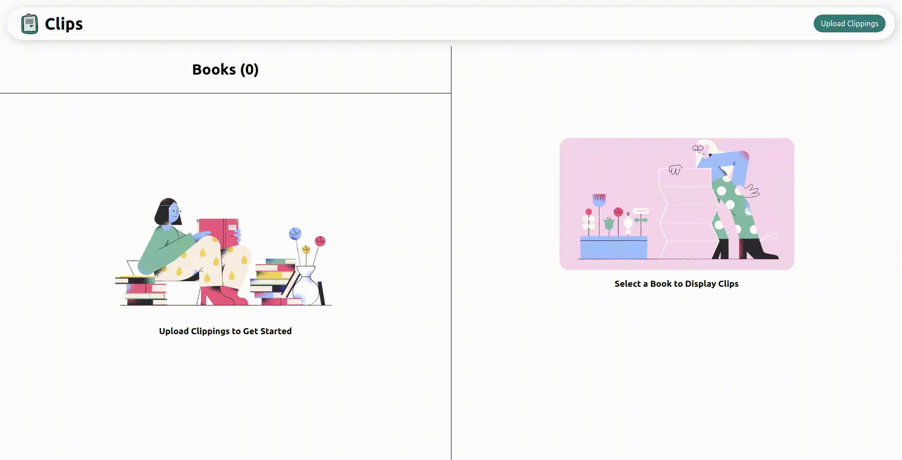

# Clips -- Kindle Clippings Parser

A Web App that parses kindle clippings into usable format



## Running Locally

### From Source

#### 1. Clone the repo onto your local machine using `git clone`

```bash
  git clone https://github.com/D3vd/Clips.git
```

#### 2. Install dependencies

```bash
  yarn
```

(or)

```bash
  npm install
```

#### 3. Start App

```bash
  yarn start
```

(or)

```bash
  npm start
```

### Using Docker

```bash
  docker run -p 3000:80 d3vd/clips
```
